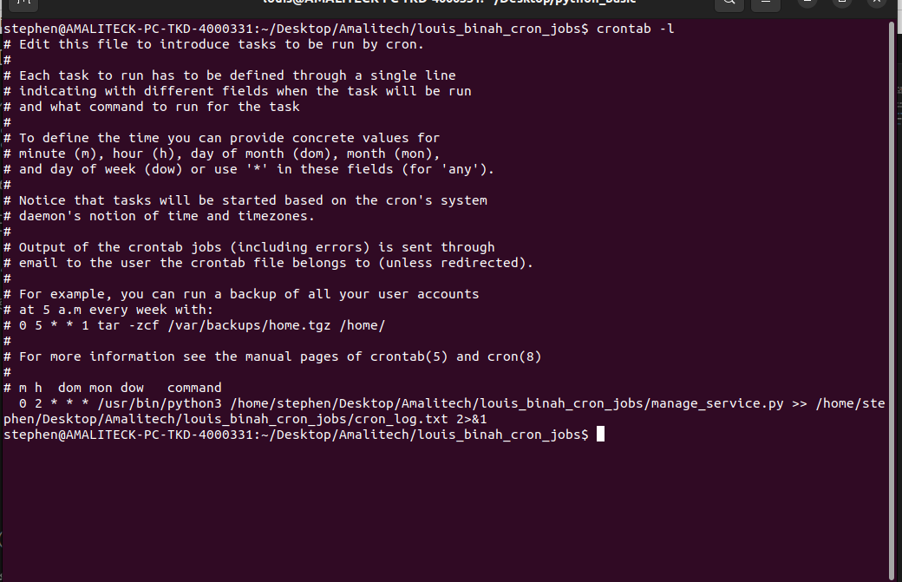

# Setting Up a Python Cron Job

This script provides a simple utility to restart system services and clear temporary folders. It uses Python's `subprocess`, `shutil`, and `os` modules to interact with the system, allowing for common maintenance tasks like restarting a service and clearing temporary directories.


## Requirements

- Python 3.x
- `systemctl` for service management (available on most Linux systems with `systemd`).
- Sudo permissions for restarting services.

## Installation

1. **Clone the repository or download the script**:
   
   ```bash
   git clone https://github.com/BINAH25/louis_binah_cron_jobs.git
   cd louis_binah_cron_jobs

2. **Create a directory for the test**:
   
   ```bash
   mkdir /tmp/test_folder

3. **install nginx**:
   
   ```bash
   sudo apt install nginx

4. **make the script executable**:
   
   ```bash
   chmod +x manage_service.py

5. **test the script**:
   
   ```bash
   python3 manage_service.py


6. **Set Up the Cron Job**:
   
   ```bash
   crontab -e

this cron job runs everyday at 2am


7. **Verify the Cron Job**:
   
   ```bash
   crontab -l



